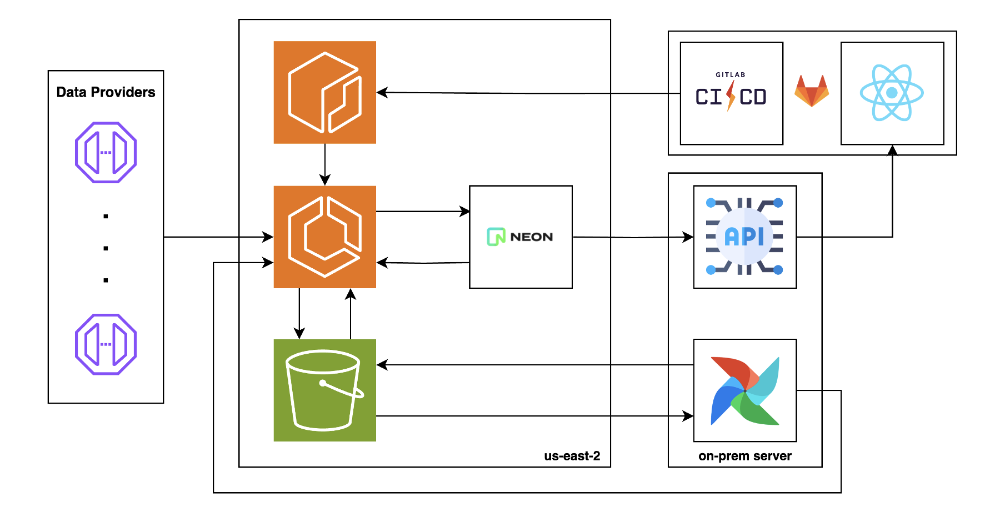

# Asset Management System Design

This project is a simplified version of a system I designed for an asset management firm. The goal was to modernize their tech stack, improve operational efficiency, and enable them to scale their investment universe.

## Context

The asset management firm had a small team and approximately R$100MM in assets under management. They primarily focused on stocks but were looking to expand into other markets and asset classes.

A key differentiator of the firm was its fully systematic approach. They used factor investing for stock selection and, by the time I joined, managed three stock-focused funds, relying on proprietary models to determine which assets to buy and short.

## Challenges

Despite the strong track record of their funds, technical limitations hindered their ability to scale. The primary challenges were:

1. **Sequential Data Pipeline:** The entire system was a Cron job running Python and R scripts, with each step outputting CSV files, making the process inefficient and fragile.

2. **Single Data Provider Dependency:** Relying on a single data provider posed a significant risk—any downtime could completely halt trading operations.

3. **Inefficient Data Processing:** The pipeline reprocessed the entire historical dataset daily, consuming unnecessary compute resources and increasing execution time.

4. **On-Premises Execution:** The data processing happened on a single desktop in the office. Power outages or hardware failures could prevent portfolio generation and disrupt trading.

While this setup functioned for analyzing Brazilian stocks, it was unsustainable for expansion into larger markets like the US, where the investment universe would grow by a factor of 100 — far beyond the existing architecture’s capacity.

## Solution

To address these issues, I designed a new architecture that balanced scalability, efficiency, and cost-effectiveness. The final architecture is illustrated below:

Given the team's initial resistance to cloud computing and budget constraints, I implemented a **serverless-first** approach to minimize costs while ensuring scalability. The key improvements included:

- **Adopting Apache Airflow** for orchestration, enabling parallel task execution.

- **Migrating job execution to AWS ECS Fargate**, leveraging managed compute resources.

- **Using Amazon S3 for temporary file storage** and **Neon (managed PostgreSQL) for calculated metrics and portfolio data**, ensuring high availability and autoscaling.

- **Integrating multiple data providers**, reducing dependency risk.

- **Developing a REST API with FastAPI** and a **web dashboard with React**, providing real-time tracking of operational KPIs.

- **Implementing CI/CD pipelines**, automating deployment and reducing manual intervention.

## The Results

The new architecture delivered significant improvements:

- **90% reduction in pipeline execution time**, providing traders with more time to execute trades and gain an operational edge.

- **100x expansion in the investment universe**, enabling market diversification.

- **Enhanced transparency and interpretability** through the web dashboard, which helped attract investments representing 10% of the firm’s AUM.

## Disclaimer

This repository contains a simplified version of the original system. For simplicity, Neon has been replaced with MongoDB Atlas, and a single example DAG is provided. The proprietary models used by the firm are not included.

Here's a link to the repo of a mocked version of the web dashboard created for the firm: [AlphaTracker](https://github.com/pedrotramos/AlphaTracker)